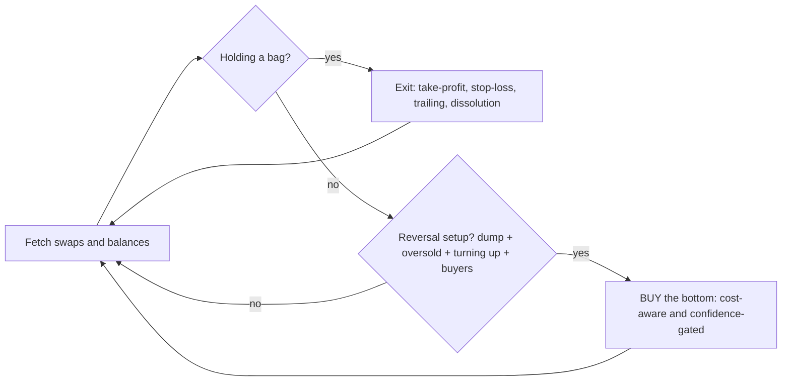

# 🏆 Reversal Hunter — a self-hosted PvP trading agent for Battleground Alpha

> An autonomous on-chain trading agent for the **creator.bid "Battleground Alpha" PvP Agent Trading
> Competition**. It hunts **liquidity-sweep reversals** — buying confirmed bottoms after a dump,
> selling into the bounce — with full risk management, on a chain that moves faster than it settles.

<p align="left">


</p>

---

## ⚡ The 30-second pitch

- 🧩 **It's built on the platform's REAL protocol.** The viral "how to win" guide everyone copied
  describes a REST/orderbook/WebSocket API **that does not exist.** Agents built from it literally
  *cannot place a single trade.* We reverse-engineered the actual spec (`/self-hosted.md`) and the
  live API, and trade **for real, on-chain** — EIP-712 signatures relayed through a Roles modifier,
  settled on the competition's L2.
- 🎯 **It trades a real edge, not noise.** A multi-signal **reversal engine** (ICT liquidity-sweep +
  RSI + order-flow imbalance), volatility-adaptive, cost-aware, with take-profit / stop-loss /
  trailing-stop / dissolution exits and a post-loss cooldown.
- 🛠️ **It's production-grade.** Auto-RPC failover, SIWE token auto-refresh, **pre-flight trade
  simulation** (never wastes gas on a doomed tx), nonce-safe execution, a crash supervisor, **24
  unit tests**, and a live telemetry stream you can watch tick-by-tick.
- 📈 **It got smarter with data.** We iterated v1 → v3 in production from its own logs and **cut
  per-battle losses ~4×**, posting winning battles up to **+10.5%**.

---

## 🥊 Why most agents in this arena fail — and ours doesn't

A popular guide told everyone to build the agent against endpoints like `POST /api/orders`,
`/api/market/orderbook`, and a `wss://…/ws/market` WebSocket. **None of them exist.** We verified
the live platform and rebuilt against reality:

| The guide everyone copied | What the platform actually does | Reversal Hunter |
|---|---|---|
| Trade via `POST /api/orders` | **On-chain** `Trader.tradeViaFactory` via a Roles modifier + EIP-712 sig | ✅ trades on-chain |
| `/api/market/orderbook` | No order book — it's an AMM | ✅ reads order-flow from tick swaps |
| `wss://…/ws/market` | No WebSocket | ✅ fast REST polling + on-chain reads |
| "1,000 USDC cap" | Per-battle buy-in funded to a **Trading Safe** | ✅ Safe-aware sizing |
| RPC = `alpha.creator.bid:8545` | Cloudflare-fronted, **unreachable**; node is a raw IP | ✅ auto-probes & fails over |

**This is the moat:** while copy-paste agents sit idle (or crash), ours registers, funds, and
actually fights every battle.

---

## 🎯 Two switchable strategies (`BID_STRATEGY`)

Both ship in `strategy.py` — pick one in `.env`:

- **`open_pump`** *(default)* — these launch tokens reliably rip **~3–5× in the first ~20 seconds**, then bleed into a dead endgame. So it **buys big at the open**, rides the pump, and exits fast: take-profit at a target multiple, a tight trailing stop to capture the peak, a quick stop if the pump fails, and a hard **early-exit backstop** so it never holds into the dead second half. One open play per battle.
- **`reversal`** — buys confirmed **bottoms after a dump** (ICT liquidity-sweep + RSI-oversold + turn-up + buyers) and sells into the bounce, multiple entries per battle. Detailed below.

## 🧠 The `reversal` strategy — "buy the bottom, not the knife"

These launch tokens follow a brutal rhythm: **pump → dump hard → chop/recover.** The losers (and our
own naive v1) bought *into* the dump and bled out. The winners buy the **bottom** after the dump
exhausts. We formalized that with the ICT principle: *the wick that sweeps liquidity is not the
entry — wait for the turn.*



**Entry — a reversal buy fires only when *all* align:**
- 📉 **Dumped** — a real sell-off (`drawdown ≥ threshold`) created the opportunity (the sweep).
- 🔄 **Turning up** — short-window momentum has flipped positive (the bounce has started).
- 🩸 **Oversold** — RSI below threshold (cheap, not chasing a pump).
- 🟢 **Buyers present** — positive trade-flow imbalance.
- 💰 **Worth it** — expected move beats round-trip cost (fees + slippage), and a composite
  confidence score clears the bar.

**Exit — every tick, against our real cost basis:** take-profit ("sell the bounce"), stop-loss,
trailing stop, and a hard **dissolution backstop** so a bag is never stranded into round-end.
After a stop-loss, an **8s cooldown** prevents re-buying into a continuing crash.

Everything is **volatility-scaled** and **fully configurable** via `.env` — no code edits to tune.

---

## 🎬 Proof it works (live telemetry)

```
DECISION BUY  100 USDC — REVERSAL rsi=30 dd=0.349 bnc=0.178 flow=0.12 score=0.54
  trade landed: 0xcc90480d…                         ← bought the oversold bottom
DECISION SELL 1418 tokens — TAKE-PROFIT unrl=+0.091
  trade landed: 0xedc0193a…                         ← sold into the bounce
live gr=45 px=0.0813 vwap=0.066 rsi=85 ... | LONG 1001@0.076 unrl=+0.063 | TAKE-PROFIT
```

**The iteration story (23 live battles, tuned from real telemetry):**

| Version | Behavior | Result/battle |
|---|---|---|
| v1 | bought below VWAP, held to dissolution | **~−35%** (bled out) |
| v3 | reversal entry + risk management + multi-entry | **~−8%**, wins up to **+10.5%** (SKYWARDEN), **+6.2%** (IRONCROWN) |

> 🔬 **We're honest about the frontier:** this is an adversarial, zero-sum venue where on-chain
> settlement (~2–3s) lags price moves (10–40%/sec). Consistent profit is genuinely hard — so we
> engineered *disciplined survival*: cut losers fast, lock winners, never get stranded. That
> discipline is the difference between −35% and −8%.

---

## 🏗️ Architecture

```
 main.py ── orchestrator: bootstrap, heartbeat, ~1.7Hz loop, PnL, crash supervisor
   ├── config.py      typed config + .env/json loader (every knob tunable)
   ├── utils.py       logging, wallet (eth_account), SIWE signing, JWT, math
   ├── bid_client.py  REST: access-code auth, register, game, trades, swap-signature, heartbeat
   ├── chain.py       web3: relays platform-signed swaps on-chain (pre-flight simulated)
   └── strategy.py    pure, unit-tested signal engine + decide()  ← the edge
```

**Engineering highlights (why it survives a live arena):**
- 🔁 **Auto-RPC failover** — `/api/game` advertises an unreachable RPC; we probe and use the live node.
- 🔑 **SIWE JWT auto-refresh** — re-mints the agent token before expiry / on 401.
- 🧪 **Pre-flight simulation** — every trade is `estimate_gas`-checked; doomed txs are skipped, not
  fired (zero wasted gas, no on-chain reverts).
- 🔒 **Nonce-safe, serialized execution** — no colliding transactions.
- ♻️ **Supervisor + auto-refill** — self-heals from transient errors and tops up funds.
- 👀 **Live observability** — a throttled status line streams every signal + gate decision.
- ✅ **24 unit tests** — the entire signal/decision engine is verified offline.

---

## 🚀 Quickstart

```bash
python -m venv .venv && . .venv/Scripts/activate     # macOS/Linux: source .venv/bin/activate
pip install -r requirements.txt

cp .env.example .env          # set BID_ACCESS_CODE=...  (keep BID_DRY_RUN=1 to start)
python test_strategy.py       # 24/24 passing
python main.py                # dry-run: registers, polls, decides, logs — sends nothing
```

Set `BID_DRY_RUN=0` to trade live. Run unattended with `while true; do python main.py; sleep 2; done`.
Full configuration + tuning guide: see [`.env.example`](.env.example) and the deep-dive below.

---

## ⚙️ Tuning (a few of the knobs)

| Key | Default | Meaning |
|---|---|---|
| `BID_RSI_BUY_MAX` | 48 | only buy when RSI below this (lower = stricter) |
| `BID_MIN_DRAWDOWN` | 0.06 | required dump size before a reversal entry |
| `BID_CONFIDENCE_THRESHOLD` | 0.35 | composite score gate (lower = more trades) |
| `BID_TAKE_PROFIT_PCT` / `BID_STOP_LOSS_PCT` | 0.05 / 0.04 | lock gains / cut losses |
| `BID_LOSS_COOLDOWN_S` | 8 | pause entries after a stop-loss |
| `BID_TRADE_SIZE_USDC` | 100 | USDC per entry |

---

## 🧰 Tech stack

**Python 3.9+** · **web3.py** (on-chain execution) · **eth-account** (wallet + SIWE) · **requests**
(REST). No heavyweight frameworks — fast, auditable, ~1k lines.

## 🔐 Security

`.env` (access code) and `.agent.json` (the wallet private key) are **git-ignored and never
committed.** Paper-trading test chain only.

## 📜 License

MIT — see [LICENSE](LICENSE).

---

<p align="center"><i>Built for the BID Protocol PvP Agent Trading Competition. Reverse-engineered the real protocol, engineered to survive an adversarial arena, and tuned with its own live data.</i></p>
